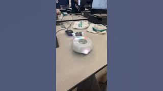

# Final Project: Finch Robot Challenges

## Essential Question
How can we apply object-oriented programming principles and Java concepts to create interactive, autonomous robot behaviors that solve real-world challenges?

## Project Overview
In this project-based learning experience, you will program a Finch 2.0 robot to perform one of three challenges:
1. Choreograph a dance routine (with movement, lights, and sound)
2. Create an artistic drawing using the robot's movements
3. Navigate a maze autonomously

Your program must demonstrate your understanding of Java programming concepts from APCSA and object-oriented design principles while creating an engaging robot behavior.

## Learning Objectives
- Apply Java programming concepts in a physical computing context
- Implement object-oriented design principles
- Develop problem-solving skills through algorithm development
- Create well-documented and maintainable code
- Practice technical communication through presentations and documentation

## Description of design choices
In this project, I attempted to create a dance by my finch completing a series maneuvers including spins, audio notes, visuals with letters/lights, and wiggles. First, the finch will spin right 3 times for 360 degrees, totaling to 1080 degrees. Then, the finch will play a note with one beat and turn on all of its lights with a variety of colors: red, green, blue, pink, and white. The lights will stay on until the code is fully finished, and the finch will then display its own name "THUMPER" on the provided screen while playing notes that start at a low pitch, go to the highest possible pitch, and then back down to the lowest starting pitch. After that has been completed, the finch will pause for 1 second and then follow with a spin to rewind from the first one, instead spinning left 3 times for 360 degrees, also totaling to 1080 degrees. Then, the finch will wiggle its tail back and forth 8 times, while simulataneously playing notes once every 2 wiggles. Following that, a final note is played to conclude the dance and mark its completion. 

## Challenges faced and solutions
A challenge I faced while created my project was the creative process I went through on deciding what I wanted my finch to do in the dance. I didn't want to just make the finch do a bunch of random movements and call it a dance, so I tried to keep somewhat of a structure through it and I wanted there to be a specific order that the person viewing would be able to identify. Adding the right spin at the beginning and the left spin at the end was one of the ways that I tried to implement this objective into my code.

## Future enhancements
If I had more time and less limits, I think it would be cool if the finch was able to print out more detailed audio instead of specific notes. A component I would have tried to expand on in my project if I had more time would be to blend my movements together with nicer transitions, as I feel that the dance itself is a bit choppy and I want it to be more seamless when moving onto/executing the next part of the code. I also wanted to make my program with more complex code, with different kinds of iterations/loops to apply some more topics we covered this year in class.

## Video or images of your robot in action (embedded or linked)
[)(https://youtube.com/shorts/XUZ1sMrup44?feature=share)) (Sorry - I couldn't find a higher quality thumbnail)
